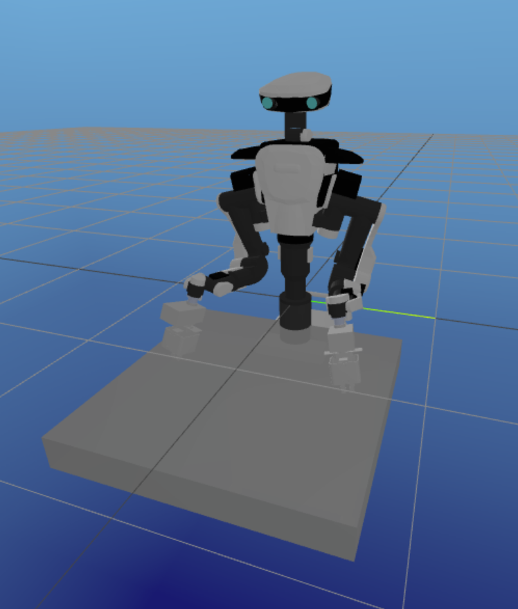

# ArmRobot.jl (Julia module)
# arm_robot_jl_ros (ROS1 package)


## ROS1(ros-o) installation for Ubuntu22.04 and Ubuntu 24.04 users.
```bash
# Configure ROS One apt repository
sudo apt install curl
sudo curl -sSL https://ros.packages.techfak.net/gpg.key -o /etc/apt/keyrings/ros-one-keyring.gpg
echo "deb [arch=$(dpkg --print-architecture) signed-by=/etc/apt/keyrings/ros-one-keyring.gpg] https://ros.packages.techfak.net $(lsb_release -cs) main" | sudo tee /etc/apt/sources.list.d/ros1.list
echo "# deb [arch=$(dpkg --print-architecture) signed-by=/etc/apt/keyrings/ros-one-keyring.gpg] https://ros.packages.techfak.net $(lsb_release -cs) main-dbg" | sudo tee -a /etc/apt/sources.list.d/ros1.list
# Install and setup rosdep
# Do not install python3-rosdep2, which is an outdated version of rosdep shipped via the Ubuntu repositories (instead of ROS)!
sudo apt update
sudo apt install python3-rosdep
sudo rosdep init
# Define custom rosdep package mapping
echo "yaml https://ros.packages.techfak.net/ros-one.yaml one" | sudo tee /etc/ros/rosdep/sources.list.d/1-ros-one.list
rosdep update
# Install packages, e.g. ROS desktop
sudo apt install ros-one-desktop
```
For more details, visit [how to build ros-o](https://ros.packages.techfak.net).


## Setup
```bash
cd <path_to_catkin_ws>
source devel/setup.bash
cd src
git clone ...
cd arm_robot_jl_ros
rosdep update --include-eol-distro
rosdep install --from-path . -i -r -y
cd <path_to_catkin_ws>
source devel/setup.bash
catkin build
```